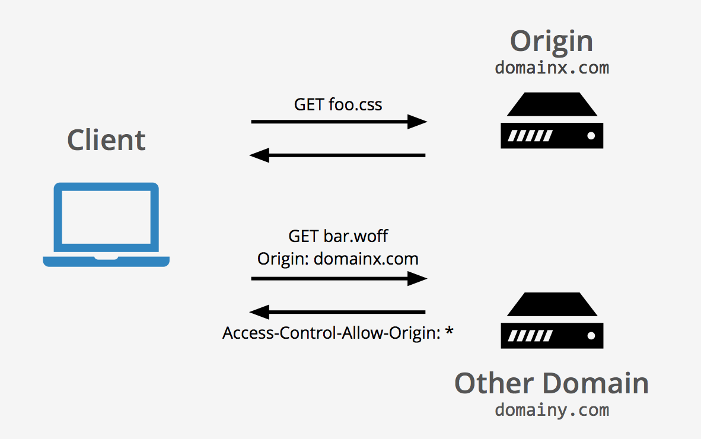
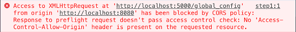
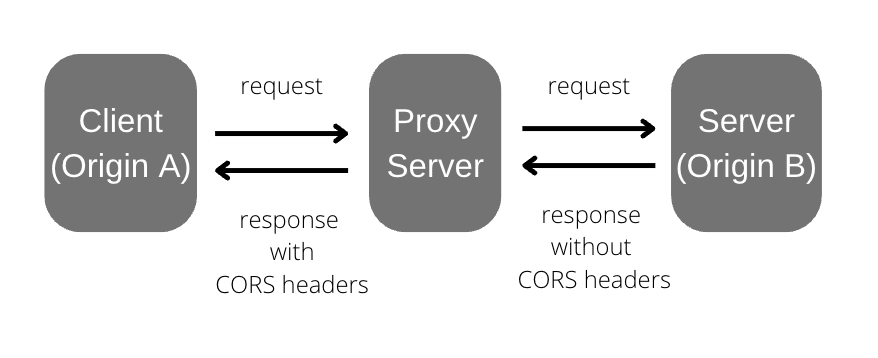
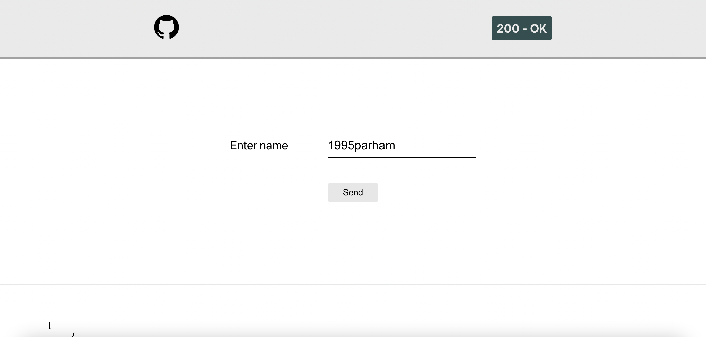

<h1 align="center">
  Cross-origin Resource Sharing
</h1>

<br />

<p align="center">
  Fixing CORS policy example (React/Golang)
</p>

<p align="center">
    
    
    
</p>

<br />

## What is CORS policy?

**Cross-origin resource sharing (CORS)** is a standard mechanism that allows **JavaScript XMLHttpRequest (XHR)** calls executed in a
web page to interact with resources from non-origin domains. 
**CORS** is a commonly implemented solution to the same-origin policy that is enforced by all browsers.

<p align="center">
  
</p>

## CORS error

**Cross-Origin Resource Sharing (CORS)** errors occur when a server doesn't return the HTTP headers required by the CORS standard. 
To resolve a CORS error from an API Gateway REST API or HTTP API, you must reconfigure the API to meet the CORS standard. 

<p align="center">
  
</p>

### How to fix it?

It's often can git fixed with a **proxy server (CORS Proxy)**. We can run a proxy server on the address that we want to send our HTTP requests to.
**CORS Proxy** allows us to bypass **CORS errors** using a proxy server that acts as a bridge between the client and the server. 
So, instead of requesting the target server, it sends the request to the proxy server instead.

<p align="center">
  
</p>

<br />

## Example

Let's create a HTTP server with Golang that has the following endpoints and runs on ```localhost:8080```.

```json
[
  {
    "url": "/api/time",
    "method": "GET",
    "response": {
      "time": "19:05:22 GMT",
      "time-zone": "asia"
    }
  },
  {
    "url": "/api/ip",
    "method": "POST",
    "headers": [
      {
        "content-type": "application/json"
      }
    ],
    "body": {
      "ip": ["127.0.0.1", "127.0.2"]
    },
    "response": [
        {
          "127.0.0.1": "valid"
        },
        {
          "127.0.2": "invalid"
        }
      ]
    }
]
```

```shell
cd api
go build . -o ./main
./main
```

Now let's create a React application that runs on ```localhost:3000```.

```shell
cd application
npm start
```

<p align="center">
    
</p>
